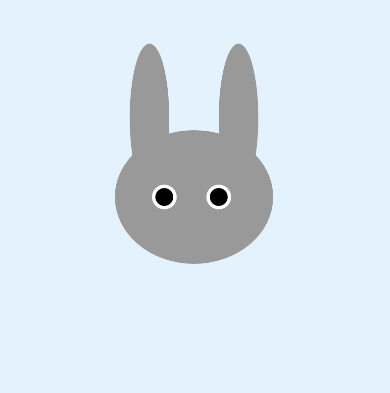
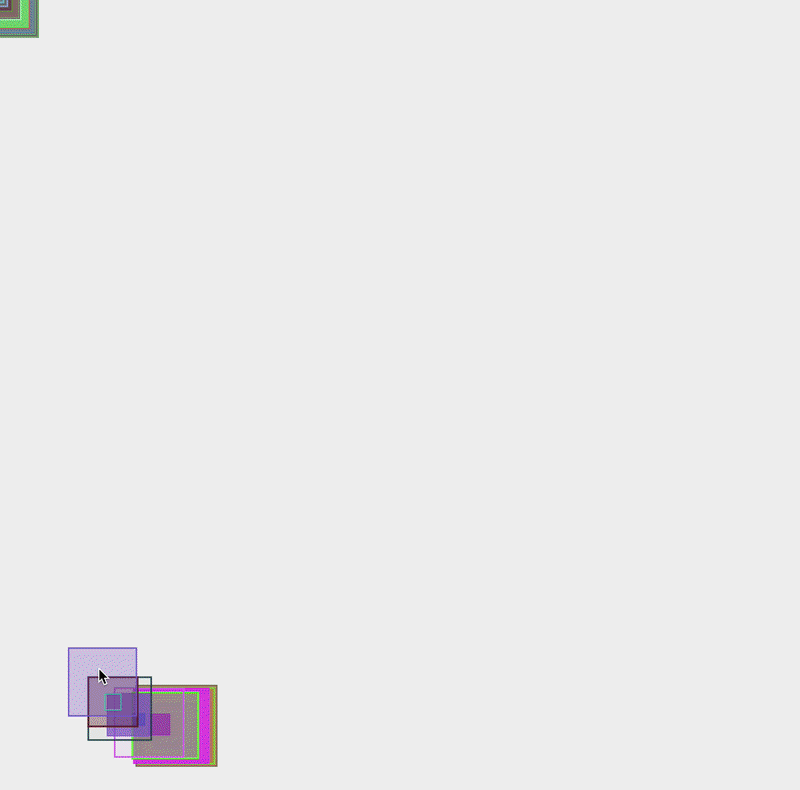

# Week 01 — Basics & Drawing with Code

<!-- Replace ## with the week number and Topic Name with the week's focus -->
<!-- You may also refer to each week's slide for the Topic Name -->
<!-- e.g. Week 03 — Arrays & Functions -->

---

### Activities

| Activity | What I Made                   |
| -------- | ----------------------------- |
| `1a`     | Created a simple bunny using basic shapes, colours and styling in p5.js. |
| `1b`     | Modified an existing generative art sketch using the coding techniques introduced during the week. |

<!-- Add or remove rows to match the activities for this week. -->

---

### This Week

<!-- A short, informal summary of what you explored across the week's activities. What did you make? What clicked? What didn't?
     A few sentences is all you need — write it like a journal entry, not a report. -->

I was introduced to the basics of p5.js and drawing with code. I learned how `setup()` and `draw()` work, how the coordinate system is organised, and how different shapes are drawn in the order they appear in the code. 

In the first activity I created a bunny using simple shapes and experimented with properties such as position, size and colour. In the second activity I modified an existing sketch and experimented with the code to create my own version. It was interesting to see how changing only a few values could completely change the visual result.

---

### Output

<!-- Drop a screenshot, photo, or GIF of something you made this week.
     Save it to a readme-assets/ folder inside this week's folder.
     Made more than one thing worth showing? Add more images. -->

### 1a — Simple Creatures



### 1b — Learning by Making



---

<!-- ─────────────────────────────────────────────────────
     GOING FURTHER — if you want to document more, here are some ideas:

     ### 1a — Activity Name
     
     What you tried, what you discovered.

     ### 1b — Activity Name
     
     What you tried, what you discovered.

     ### 🧩 Something I Found Interesting
     A line of code, a technique, a happy accident — paste it here.
     ```js
     // your code here
     ```

     ### ❓ Questions I'm Sitting With
     Anything unresolved, something you want to revisit, or a rabbit hole you fell into.

     ### 🔗 References
     Links to anything that helped or inspired you this week.
     ───────────────────────────────────────────────────── -->
