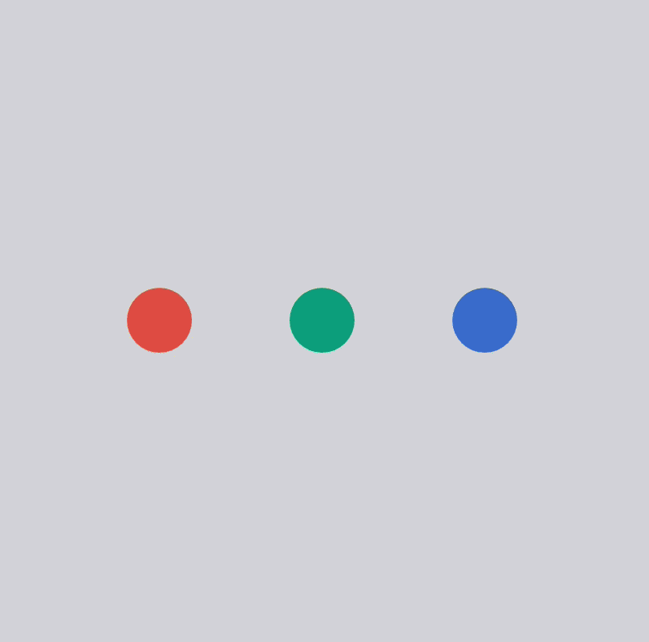
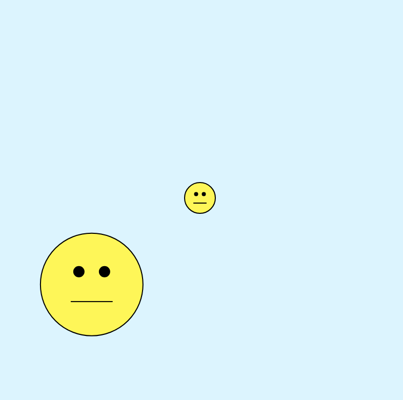

# Week 03 — Arrays, Functions & Transformations

<!-- Replace ## with the week number and Topic Name with the week's focus -->
<!-- You may also refer to each week's slide for the Topic Name -->
<!-- e.g. Week 03 — Arrays & Functions -->

---

### Activities

| Activity | What I Made                   |
| -------- | ----------------------------- |
| `3a` | Created an interactive sketch that visualises values (colors and sizes) stored in arrays. |
| `3b` | Created a custom function with parameters and transformations creating faces. |

<!-- Add or remove rows to match the activities for this week. -->

---

### This Week

<!-- A short, informal summary of what you explored across the week's activities. What did you make? What clicked? What didn't?
     A few sentences is all you need — write it like a journal entry, not a report. -->

This week I worked with arrays, functions and transformations in p5.js. In the array activity I used arrays to control the size and colour of circles, and added mouse and keyboard interaction to cycle through values, add new items with `.push()` and remove items with `.splice()` from the array.

In the function activity I created a custom `face()` function with parameters for position and size. I used the mouse position to move the face around the canvas, which helped me understand how functions can make code more reusable and flexible.

---

### Output

### 3a — Array Sampler



### 3b — One Function Wonder



<!-- Drop a screenshot, photo, or GIF of something you made this week.
     Save it to a readme-assets/ folder inside this week's folder.
     Made more than one thing worth showing? Add more images. -->

---

<!-- ─────────────────────────────────────────────────────
     GOING FURTHER — if you want to document more, here are some ideas:

     ### 1a — Activity Name
     
     What you tried, what you discovered.

     ### 1b — Activity Name
     
     What you tried, what you discovered.

     ### 🧩 Something I Found Interesting
     A line of code, a technique, a happy accident — paste it here.
     ```js
     // your code here
     ```

     ### ❓ Questions I'm Sitting With
     Anything unresolved, something you want to revisit, or a rabbit hole you fell into.

     ### 🔗 References
     Links to anything that helped or inspired you this week.
     ───────────────────────────────────────────────────── -->
