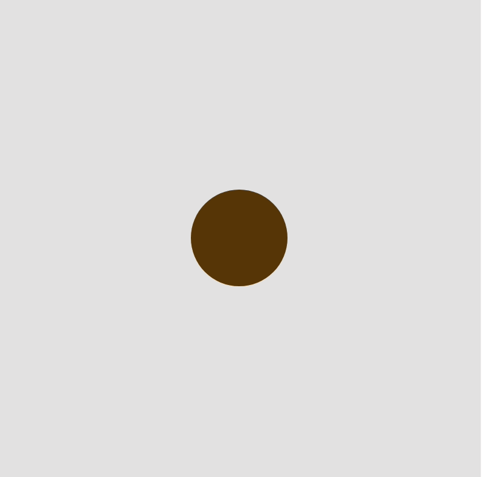
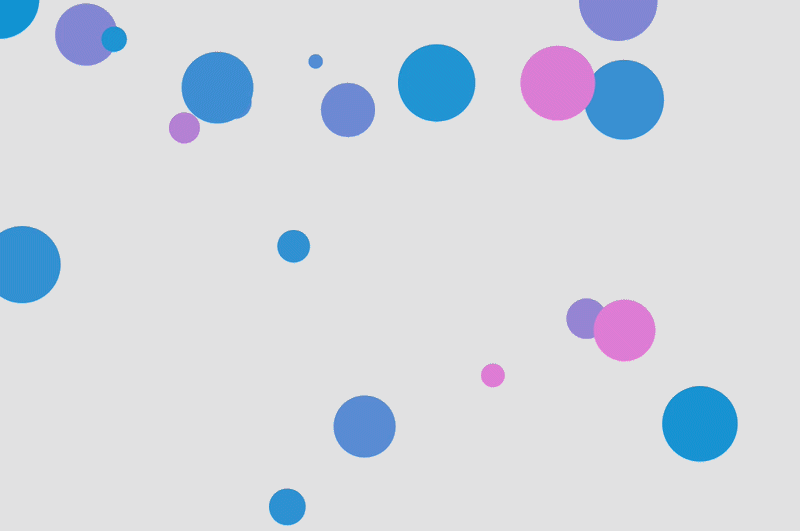

# Week 04 — Blueprints & Objects

<!-- Replace ## with the week number and Topic Name with the week's focus -->
<!-- You may also refer to each week's slide for the Topic Name -->
<!-- e.g. Week 03 — Arrays & Functions -->

---

### Activities

| Activity | What I Made                   |
| -------- | ----------------------------- |
| `4a` | Modified a sketch using a `Cookie` class and added keyboard interaction. |
| `4b` | Created a new method beyond `update()` and `show()` and experimented arround with different starting values. |

<!-- Add or remove rows to match the activities for this week. -->

---

### This Week

<!-- A short, informal summary of what you explored across the week's activities. What did you make? What clicked? What didn't?
     A few sentences is all you need — write it like a journal entry, not a report. -->

This week I worked with classes and objects in p5.js. I learned how constructors, properties and methods can be used to give objects their own values and behaviours.

I completed a `Cookie` class with movement and random flavour changes. In the second activity I experimented with multiple `Agent` objects by changing their size and speed. I also made the agents bounce at the edges and added a new method called `grow()` that makes them grow over time.

---

### Output

### 4a — Bake a Cookie



### 4b — Objects in Motion



<!-- Drop a screenshot, photo, or GIF of something you made this week.
     Save it to a readme-assets/ folder inside this week's folder.
     Made more than one thing worth showing? Add more images. -->

---

<!-- ─────────────────────────────────────────────────────
     GOING FURTHER — if you want to document more, here are some ideas:

     ### 1a — Activity Name
     
     What you tried, what you discovered.

     ### 1b — Activity Name
     
     What you tried, what you discovered.

     ### 🧩 Something I Found Interesting
     A line of code, a technique, a happy accident — paste it here.
     ```js
     // your code here
     ```

     ### ❓ Questions I'm Sitting With
     Anything unresolved, something you want to revisit, or a rabbit hole you fell into.

     ### 🔗 References
     Links to anything that helped or inspired you this week.
     ───────────────────────────────────────────────────── -->
