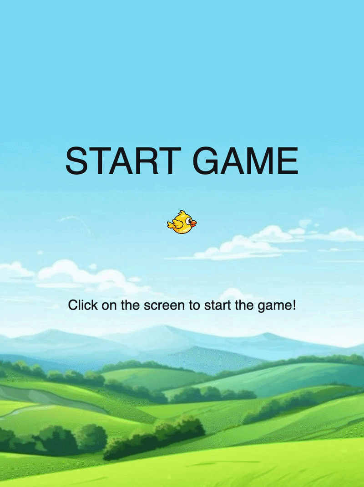

# Mini Project — Flappy Bird

<!-- Replace "Title" with the name of your project, e.g. "Mini Project — Pong Remix" -->

---

### The Project

<!-- What did you build and what makes it yours? A few sentences is enough.
     What did you change, add, or push beyond the scaffold? -->

For this mini project, I created my own version of Flappy Bird using the provided starter scaffold.

I completed the main gameplay by adding bird controls, continuously spawning pipes, collision detection, scoring, game states and restart functionality. I also customised the visual appearance by adding my own bird, pipe and background images, as well as sound effects for scoring and game over. The final outcome was intended to be close to the orginal gam of flappy bird, but with my own personal assets impemented.

The game begins on a start screen, and the player clicks the screen to begin. The bird is controlled using the spacebar or the up arrow key. The goal is to fly through as many pipe gaps as possible without colliding with the pipes or the ground.

---

### Output



<!-- Drop a screenshot or GIF of your finished project.
     Save it to a readme-assets/ folder inside this project folder.
     Got more than one good screenshot? Add them. -->

The sound effects could not be recorded in the screen-recorded video on my computer😢

[Watch Online](https://drive.google.com/file/d/117zVTbkh6xnCTA0Hyr9YH4QSbj7kxGoW/view?usp=sharing)

<!-- Replace the link above with a URL to a screen recording or video of your project.
     ⚠️ Make sure the file or page is set to public before submitting. -->

---

### ✍️ Reflection

<!-- 200–300 words on your process. Write freely — this isn't an essay.
     Some prompts to get you started:
     — What did you set out to make, and how did the result compare?
     — What inputs does your sketch respond to, and how did you approach that?
     — What was your biggest challenge, and how did you work through it?
     — What would you push further if you had more time? -->

For this mini project, I chose to create my own Flappy Bird-style game. My goal was to turn the starter scaffold into a complete and playable game with working controls, collision detection, scoring, different game states, sounds, and custom visuals. I think the final result matched what I originally wanted to create, while also giving me several challenges to solve during the process that gave me valuable knowledge.

The sketch responds to different inputs depending on the game state. The player clicks on the screen to start the game, uses the spacebar or the up arrow key to make the bird flap, and presses R to restart after game over.

One challenge was restarting the game properly. I wanted the game to restart without reloading the webpage, but at first some of the old game values remained. I solved this by creating a separate `restart()` function that resets the score, spawn counter, pipes, bird position, and game state so that a completely new round can begin.

I also had difficulties with the pipe graphics. Instead of using one complete image that got dragged out, I split the pipe into separate body and head images, which made them easier to resize and position around the gap.

Another major challenge was adding sound effects. At first, I got the error `ReferenceError: loadSound is not defined.` After some research I chose to ask ChatGPT to help me troubleshoot the issue and found out that I needed to include the p5.sound library in my HTML file by adding the p5.sound.min.js script. I therefore added: 

`<script src="https://cdn.jsdelivr.net/npm/p5.sound@0.4.1/dist/p5.sound.min.js"></script>`

If I had more time, I would have added buttons for the different game-states, instead of mousePressed and keyPressed, and also add a pause-screen and high-score system displayed on game over.

---

### ✨ What I Changed
- Added a start screen
- Added a custom background image
- Added score and game-over sound effects
- Added restart functionality using the R key
- Replaced the original shapes with custom bird and pipe images

### 🔍 Code Structure
- `sketch.js` — contains the main game loop, game states and input controls.

     - `Bird` class — controls the bird's position, velocity, gravity, flapping and display.
     - `Pipe` class — controls pipe spawning, movement, collision detection and scoring.
- `assets/` — contains the bird, pipe, background and sound assets.


---

<!-- ─────────────────────────────────────────────────────
     GOING FURTHER — want to document more? Try any of these:

     ### ✨ What I Changed
     A short list of the additions and modifications you made to the scaffold.
     - Changed the paddle to use mouse tracking instead of keyboard
     - Redesigned the visual language with a retro CRT aesthetic

     ### 🔍 Code Structure
     Briefly explain how your files are organised.
     - `sketch.js` — main game loop
     - `Ball.js` — ball class with collision logic
     - `assets/` — sprites and sounds

     ### 🧩 Something I'm Proud Of
     A snippet of code, a design decision, a moment where it clicked.
     ```js
     // your code here
     ```

     ### 🔗 References
     Anything that helped or inspired you — tutorials, artworks, tools.
     ───────────────────────────────────────────────────── -->
